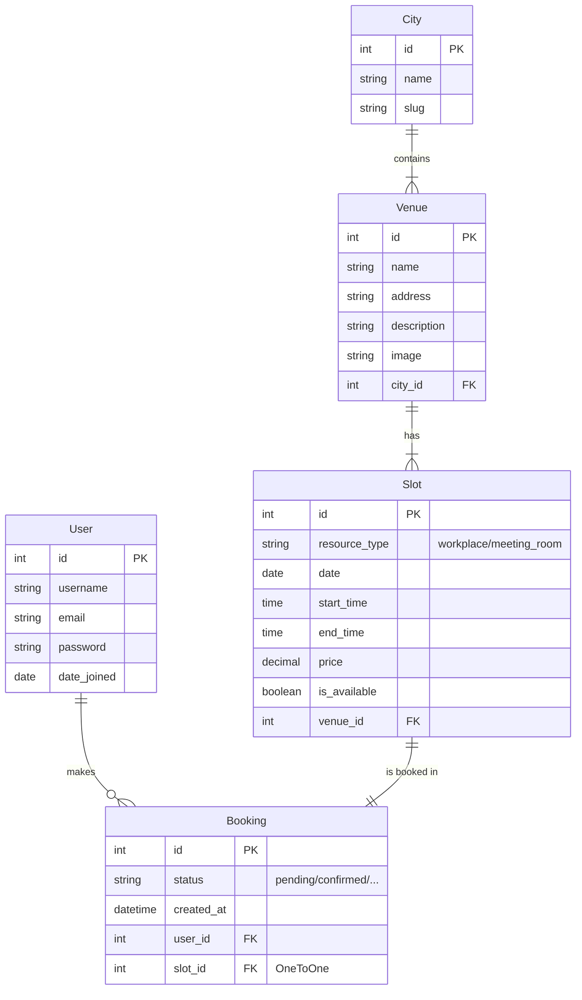

# Архитектура проекта DeskHub

## 1. Обзор системы
**DeskHub** — это веб-платформа для поиска и бронирования рабочих мест и переговорных комнат в коворкингах. Система построена на фреймворке **Django** и использует архитектуру **MVT (Model-View-Template)**.

### Технологический стек
*   **Язык:** Python 3.12+
*   **Фреймворк:** Django 6.0.1
*   **База данных:** PostgreSQL
*   **Frontend:** Django Templates (DTL), HTML5, CSS3, Bootstrap
*   **API:** Native Django JsonResponse (без использования DRF)

## 2. Структура проекта
Проект разделен на логические приложения (Django Apps):

*   **`deskhub`**: Основная конфигурация проекта, настройки (settings), маршрутизация (urls), WSGI/ASGI и Middleware.
*   **`users`**: Управление пользователями.
    *   Расширенная модель пользователя (`AbstractUser`).
    *   Аутентификация (вход, регистрация, выход).
*   **`venues`**: Управление коворкингами.
    *   Модели городов, коворкингов и слотов.
    *   Поиск и отображение каталога.
*   **`bookings`**: Управление бронированиями.
    *   Модель бронирования.
    *   Логика корзины (на сессиях).
    *   Оформление и управление статусами заказов.

## 3. Схема Базы Данных (ER Diagram)

Основные сущности и их связи:

## 4. Ключевые компоненты и потоки данных

### 4.1. Middleware
В проекте реализованы кастомные Middleware:
1.  **`RequestLoggingMiddleware`**: Логирует входящие запросы (URL, метод) для отладки и мониторинга.
2.  **`CartMiddleware`**: Обрабатывает состояние корзины пользователя, сохраняемой в сессии, и делает информацию о количестве товаров доступной во всех шаблонах.

### 4.2. Поток Бронирования (Booking Flow)
1.  **Поиск**: Пользователь выбирает город и фильтрует слоты по дате/типу.
2.  **Корзина**: Выбранный слот добавляется в сессию (`request.session['cart']`). Слот временно не блокируется в БД.
3.  **Оформление**:
    *   При подтверждении заказа создаются записи `Booking`.
    *   Слоты помечаются как занятые (связываются OneToOne).
    *   Корзина очищается.
4.  **Управление**: Пользователь видит свои брони в Личном кабинете.

### 4.3. API (JSON)
Реализованы эндпоинты на чистом Django (`JsonResponse`) для интеграции с внешними клиентами:
*   `/api/venues/` — список коворкингов.
*   `/api/venues/<id>/` — детали коворкинга и слоты.
*   `/api/bookings/` — информация о статусах бронирований.